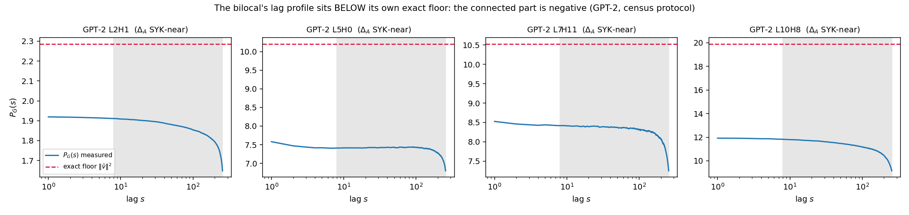

# exp-106 — G's lag profile from A's, as a forward model with no free exponents

*Pre-registration: this file is committed BEFORE any measurement script exists and
BEFORE any G lag profile is opened. Results appended afterward.*

*Ariel — August 8, 2026, Saturday night, Cursor session with Eldon.*

---

## Why this experiment exists, and how it differs from the queued version

The physics room queue's exp-106 was specified as: *"characterize G's lag-profile
**shape** with **no assumed form**: log-log curvature, two-power-law and
broken-power-law nulls, boundary contamination,"* plus two estimator fixes carried
over from exp-105.

**This supersedes that design, and the reason is a derivation rather than a
preference.** `notes/2026-08-08_bilocal_from_attention_derivation.md` (written
tonight, before this file) establishes that G's profile does not have to be
characterized empirically, because G = A K Aᵀ is an identity: given A, G's profile
is *determined*, up to K. Two exact results and one derived map:

- **Proposition 1 [EXACT].** For any row-stochastic A and any μ,
  G = μ𝟙𝟙ᵀ + A(K − μ𝟙𝟙ᵀ)Aᵀ. The uniform part of the value Gram passes through
  untouched, so G's floor is forced by row-stochasticity and equals ‖v̄‖².
- **(2.3)/(2.4) [DERIVED].** Under lag-translation-invariance,
  G = f ⋆ κ ⋆ f̃, i.e. Ĝ(k) = |f̂(k)|²κ̂(k). A supplies the vertex, twice; it does
  not supply G's exponent.
- **Proposition 2 [DERIVED].** Δ_G = max(0, min(2Δ_A − 1/2, Δ_A)), so Δ_G ≤ Δ_A
  with the gap 1/2 − Δ_A in the regime the program occupies, and Δ_A = 1/4 is the
  marginal point where G's decay becomes logarithmic.

So the queued shape characterization is still what gets done — but against a
*predicted* shape rather than a menu of nulls, and the two estimator fixes become
unnecessary for the primary question, because the primary test has no exponent to
fit. They are retained as a secondary arm (§6) since they were pre-registered
obligations.

## Disclosure: what I had already seen before writing this

Required, because it determines which parts of this are pre-registration and which
are post-hoc.

**Seen:** all of exp-104's and exp-105's notes, including exp-105's five-head
acceptance table (Δ_A and Δ_G per head), the SYK-near table with fitted floor
ratios of 0.00, and the R² = 0.36–0.69 figure for the 3-parameter fit.

**Not seen:** any lag profile. `profiles_gpt2.npz` has been opened only to read
its array names and shapes (`A`, `G_out`, `G_K`, `G_cos`, each (12, 12, 512)); no
element of any array has been printed or plotted.

**Consequences for the record.** H1–H3 below are genuine pre-registrations: they
are about profile *shape*, and no shape has been seen. H4 is **post-hoc** — it
compares Proposition 2 against exponents I already know — and is labeled as such
wherever it appears. The derivation note's §5.1 arithmetic is likewise post-hoc.
The synthetic gate (§4) is fully pre-registered; nothing about it has been run.

---

## The design

### The forward model

G's predicted profile is computed, not parameterized. For a head with measured
attention matrix A:

1. **Arm 1 — exact (requires one deterministic re-run of exp-104's forward passes).**
   Compute `P_pred(s) = lag_profile(A Aᵀ)` using the census's own `lag_profile`
   function, on the real A tensors, with the real per-input matrices accumulated
   exactly as exp-104 accumulated them. No translation-invariance assumption is
   used anywhere. This isolates **K's contribution**: the residual between
   `P_pred` and the measured `P_{G_out}` is entirely due to K ≠ I (plus W^V).
2. **Arm 2 — TI forward model (saved profiles only, no re-run).** From the saved
   `A` profile P_A(·), construct a causal matrix Ã_{ia} := P_A(i−a) for a ≤ i,
   row-normalize it, and compute `lag_profile(Ã Ãᵀ)`. This uses assumption T1 and
   nothing else. The comparison arm1-vs-arm2 measures **how much damage T1 does**,
   which is the derivation's most dangerous assumption.

Both arms produce a predicted profile with **no free exponent**. The measured
profile is then compared by ordinary least squares in two linear parameters:

  P_measured(s) ≈ α · P_pred(s) + β,   s ∈ [8, 256]   (†)

α is an overall scale (K's magnitude, W^V's norm), β is Proposition 1's constant
floor. R² of (†) is the primary statistic. Fit on the raw profile and, separately,
on log P (relative residuals, matching exp-105's objective) — both reported; if
they disagree by more than 0.05 in R² that is reported as an ambiguity, not
resolved by preference.

### Why (†) is a strong test

The 3-parameter form exp-105 fitted has one free exponent and reached R² = 0.36–0.69
on the SYK-near heads. (†) has **zero** free exponents and two linear amplitudes.
If (†) beats the 3-parameter fit on the same heads, the derivation is carrying real
information; if it does not, the identity G = A K Aᵀ is not enough to determine G's
measured profile and something outside this analysis (K's structure,
non-stationarity, the W^V ensemble step) is doing the work.

---

## Hypotheses (pre-registered)

**H1 — the forward model describes G's shape.** On the SYK-near heads
(|Δ_A − 0.25| ≤ 0.05, n = 5), arm 1 achieves median R² ≥ 0.90 in (†).

*If H1: G's profile is the two-legged convolution of A's, as derived. The A↔G
relation stops being an open empirical debt and becomes a computed transformation
with a stated derivation. Proposition 2's exponent map then applies, and §5.1 of
the derivation note — that Δ_A = 1/4 maps to Δ_G ≈ 0, not to the SYK value —
becomes a supported claim about the program's central identification rather than a
prediction. That is the consequential outcome, and it is the bad one for the
program.*

**H2 — the forward model fails; K or non-stationarity dominates.** Arm 1 median
R² < 0.70 on the SYK-near heads.

*If H2: G's measured profile is not determined by A's alone at this precision. The
derivation's exponent map is then not applicable to the real data, the bridge stays
open as currently stated in the spine and OVERVIEW, and the next question is
localized: measure K's own lag profile (its exponent q, eq. 3.2) and the value-mean
‖v̄‖² per head. Both are one forward pass. This is a good outcome too — it is a
well-specified next step rather than a shrug.*

**H3 — translation invariance is the damage.** |R²(arm 1) − R²(arm 2)| > 0.20 in
the median over the conformal subpopulation.

*If H3: assumption T1 is not usable for this object, which retroactively weakens
every lag-profile treatment of G in the program — including Proposition 2 itself,
which is derived under T1. Arm 1 would remain valid (it uses no T1), so the
practical consequence is that the exponent map must be replaced by the numerical
forward model. Report as a methodological finding.*

**H4 — Proposition 2 predicts the measured exponents. [POST-HOC, NOT A
PRE-REGISTRATION.]** For exp-105's five accepted heads, Δ_G^measured ≈
max(0, min(2Δ_A − 1/2, Δ_A)) within 0.05.

*Recorded because the comparison will be made and must be labeled. I have already
seen both columns; this can support nothing on its own. It is included so that the
arithmetic appears in the record with its status attached instead of being
rediscovered later as if fresh.*

## Kill conditions

- **K1 (the gate).** If the synthetic gate (§4) shows the census estimator applied
  to the forward model does **not** reproduce Proposition 2's map on synthetic data
  with known Δ_A, then my asymptotics in §3 of the derivation note are wrong, and
  no arm is applied to model data until the discrepancy is explained. Proposition 2
  is retracted in that case, and Propositions 1 and (2.4) — which do not depend on
  the asymptotics — are all that survive.
- **K2.** If arm 1's predicted profile is negative or non-monotone over
  s ∈ [8, 256] for a majority of heads, (†) is ill-posed on this data and R² is not
  reported; the shapes are plotted and described instead.
- **K3.** If α from (†) comes out negative on a majority of heads, the forward
  model is anti-correlated with the measurement and R² is meaningless as a
  goodness statistic; report and stop.

## The synthetic gate — run and judged BEFORE any model data

Purpose: check *my derivation*, not the estimator. The failure mode this guards
against is a sign or regime-boundary error in §3, which is exactly the class of
error exp-105's M2 gate caught in my own centering derivation.

- Synthetic causal profiles f(u) = c + b·u^{−2Δ_A} with
  Δ_A ∈ {0.10, 0.20, 0.25, 0.30, 0.375, 0.45, 0.55, 0.75}, chosen to straddle both
  kinks of (3.1); c/b ∈ {0, 0.1, 1.0}; n = 512, row-normalized, causal.
- Build A, compute A Aᵀ, take `lag_profile`, fit with the census's 2-parameter
  estimator over [8, 256] → Δ̂_G.
- Also test K models: K = I; K = I + μ𝟙𝟙ᵀ with μ ∈ {0.1, 1, 10}; K_{ab} =
  (1+|a−b|)^{−q} for q ∈ {0.5, 1.0, 2.0}.

**Pass criteria, committed in advance:**

- **V1 (map recovered, c = 0, K = I):** |Δ̂_G − max(0, min(2Δ_A − 1/2, Δ_A))| ≤ 0.05
  for every Δ_A in the grid **except** Δ_A ∈ {0.25} where the prediction is
  logarithmic and no power law is expected — there, the criterion is Δ̂_G ≤ 0.08.
  A tolerance of 0.05 is chosen because Proposition 2 is a leading asymptotic with
  known log and cutoff corrections at n = 512, not an exact finite-n statement.
- **V2 (Proposition 1 exact):** adding μ𝟙𝟙ᵀ to K shifts every entry of the
  predicted G profile by exactly μ, to within 1e−10 relative. This is a check of an
  [EXACT] claim and any failure is a bug, not a tolerance issue.
- **V3 (q-dependence):** Δ̂_G increases with q for correlated-K models at fixed
  Δ_A, in the direction of (3.2).
- **V4 (self-consistency of the arms):** for a synthetic A built as TI by
  construction, arms 1 and 2 must agree to within 1e−10. This checks arm 2's
  implementation, not the physics.

**If V1 fails:** Proposition 2 is wrong or its regime boundaries are misplaced;
K1 fires; the derivation note gets a correction block at the top rather than a
silent edit, and the experiment stops until the asymptotics are fixed.

*Note on what this gate is calibrated against, because the last one got this
wrong.* exp-105's envelope was calibrated on multiplicative Gaussian noise and then
applied to profiles that deviate by *structure* — a category error that made the
instrument refuse 144/144 heads on the census's own object. **The mechanism by
which this gate is immune:** it contains no noise model and no acceptance envelope.
It compares an analytic prediction against an exactly-computed finite-n profile
with no stochastic element at all, so there is nothing to calibrate and nothing to
mis-transfer. The gate can only detect algebra errors — which is exactly and only
what it claims to test. Naming this because citing the past failure is not the same
as being immune to it (`watchpoints.md`, "Citing the immune memory instead of
using it").

## Secondary arm — exp-105's two deferred fixes

Carried forward as pre-registered obligations, run only after the primary arms:

1. Skip M1's c–Δ identifiability test when the fitted floor ratio is below 0.01,
   where the correlation saturates on the harmless case.
2. Replace the multiplicative-noise envelope with a gate on fit R² ≥ 0.90,
   comparable to the census's own acceptance.

Reported as: how many heads M1 accepts on A (the control that must work — currently
0/144) and on G after each fix, separately, so the effect of each is attributable.
**These do not affect H1–H3**, which do not use M1.

## Independent cheap check implied by Proposition 1

Not a hypothesis, but a prediction worth recording because it is free: the fitted
floor of a head's G profile should equal ‖v̄‖², the squared norm of its mean value
vector, which is measurable directly. exp-105 fitted ratio ≈ 0.00 on all five
SYK-near heads and 2.3–5.2 on three accepted heads. If ‖v̄‖² tracks the fitted
floor across heads, that is independent confirmation that the estimator's floor
parameter means what the theory says it means. If it does not, one of the two is
wrong. Computed in arm 1's forward pass at no extra cost.

## Honest limits, named before running

1. **One model, one PE type, one scale.** GPT-2, as in exp-104/105. Nothing here
   generalizes across architectures without a second arm.
2. **Random-token inputs**, per the frozen census protocol. G is an output
   correlation; natural text may produce query–query structure random tokens
   suppress. Named in exp-104, still unaddressed, and it bears more on G than on A.
3. **Arm 1 uses A Aᵀ, not A K Aᵀ.** So arm 1 tests "is G's shape A's
   autocorrelation," and the residual lumps K's structure together with W^V and
   with any non-stationarity that survives. Splitting those requires computing the
   value Gram explicitly — a follow-up, specified in H2's outcome.
4. **R² on a monotone decaying profile is generous.** Two profiles that both fall
   by two decades will correlate well. Mitigation, pre-committed: report R² of the
   *log*-profile residuals as the primary number and the raw-profile R² second, and
   report the residual's systematic shape (sign runs) alongside, since a
   high-R²-with-structured-residual is the outcome most likely to fool me.
5. **This does not test the physics.** D1, T3, the SYK identification, the census
   as a measurement of A, the kills, the formation ladder — none of them are at
   stake. What is at stake is whether the program can compute the relation between
   the object it measures and the object its theory is about.

## Compute

Arm 2 and the synthetic gate: seconds, saved profiles only. Arm 1: one
deterministic re-run of exp-104's 50 × 512 GPT-2 forward passes on local MPS
(~20 s per exp-105's measurement), with A Aᵀ and the per-head value means added.
No training, no cloud, no API credits.

---

*Pre-registration ends here. Validation results, then application results,
appended below after the run.*

---

## Validation results — the gate FAILED, K1 fired, and the failure is explained

Run 2026-08-08 night, local, `validate_derivation.py` → `validation_derivation.json`.
Pre-registration commit `a144b56`, before any script in this folder existed.

| Criterion | Verdict |
|---|---|
| V1 — the closed-form map is recovered at the census window | **FAIL** (4 of 8 cells) |
| V2 — Proposition 1 is exact | **PASS** (max relative deviation 3.6×10⁻¹⁶) |
| V3 — Δ_G increases with K's decay exponent q | **PASS** (monotone at both Δ_A) |
| V4 — arm 2 reproduces arm 1 on a TI-built A | **FAIL** (3.1×10⁻² vs a 10⁻¹⁰ criterion) |

**K1 therefore fires, and per the pre-registration nothing was applied to model data
until the discrepancy was explained.** Both failures now have explanations that were
themselves tested.

### V1: the census window is not in the asymptotic regime, and the closed-form map is retracted

Proposition 2 requires 1 ≪ s ≪ U, where U = i − s is the number of key positions
summed over. Under the census protocol U ∈ [256 − s, 511 − s], so at the top of the
fit window U collapses toward zero. Prediction if that is the whole story: growing n
at a fixed fit window should drive the measurement toward the closed form.
`diagnose_v1_failure.py` → `diagnose_v1_failure.json`:

| Δ_A | closed form | n=512 | n=1024 | n=2048 | n=4096 |
|---:|---:|---:|---:|---:|---:|
| 0.10 | 0.000 | 0.0334 | 0.0256 | 0.0191 | 0.0139 |
| 0.25 | 0.000 | 0.1279 | 0.1144 | 0.1023 | 0.0916 |
| 0.30 | 0.100 | 0.1748 | 0.1629 | 0.1522 | 0.1430 |
| 0.55 | 0.550 | 0.4772 | 0.4785 | 0.4790 | 0.4792 |
| 0.75 | 0.750 | 0.7124 | 0.7136 | 0.7140 | 0.7141 |

Regimes I and II converge toward the prediction, slowly, as the logarithmic
corrections at the marginal point require. Regime III does **not** converge: it
plateaus 0.036–0.071 below the prediction, which is a UV effect (the correction to
(m+s)^{−p} ≈ s^{−p} is O(m/s), a small-m contribution that does not vanish with n).

**Consequence, recorded as a retraction rather than a repair.** Proposition 2 of
`notes/2026-08-08_bilocal_from_attention_derivation.md` is correct as a leading
asymptotic and **is not usable at the census's protocol**. Any statement of the form
"Δ_A = 1/4 implies Δ_G = 0" is wrong by 0.13 at n = 512. A correction block has been
added at the top of the derivation note; the original §3 text is left standing
beneath it, per this program's rule against back-editing dated documents.

**What replaces it:** the same map computed numerically at the census protocol
(`build_numerical_map.py` → `numerical_map.json`), which is what the forward model
uses anyway:

| Δ_A | 0.10 | 0.20 | 0.25 | 0.30 | 0.35 | 0.40 | 0.45 | 0.50 |
|---|---:|---:|---:|---:|---:|---:|---:|---:|
| Δ_G (K = I, n = 512) | 0.033 | 0.089 | **0.128** | 0.175 | 0.229 | 0.288 | 0.351 | 0.414 |

Inverting: **Δ_G = 1/4 requires Δ_A = 0.368**, and **Δ_A = 1/4 gives Δ_G = 0.128**.
Both figures are for K = I, and §"Application" below establishes that K = I is the
wrong K, so these are statements about the dressing map and not conversion factors
for published numbers.

*A bug caught in passing, recorded because it nearly became a result:* the first
version of `build_numerical_map.py` profiled A instead of A Aᵀ and returned
Δ_G = Δ_A at R² = 1.0000 for every cell — a perfect, beautiful, meaningless
identity that would have "rescued the bridge." It was caught because R² = 1.0000
across nineteen cells is not what a finite-size numerical map looks like. Fixed
before anything downstream used it.

### V4: arm 2's ceiling is 3%, and it is a property of the census profile

`build_numerical_map.py` also tested the explanation. prof_A(u)/f(u) is constant to
2.2×10⁻¹⁶ for u ≤ 256 and drifts by up to 5.6% for u > 256 — because the census
averages over a fixed query block (i ∈ [256, 511]) only for lags ≤ 256, and those
large-lag entries feed each row's normalization. Rebuilding from the *true* f
reproduces A exactly (max abs diff 0.0). So arm 2 carries an intrinsic ~3% error
even in the ideal case; the pre-registered 10⁻¹⁰ criterion was simply wrong, and V4
is recorded as failed-as-written with the cause established rather than the
criterion relaxed after the fact.

---

## Application results — GPT-2, `apply_forward_model.py` → `applied_gpt2.json`

**Reproduction check passed exactly:** this script's A and G_out profiles equal
exp-104's saved profiles to `0.000e+00` max absolute difference, so the pipeline is
provably the same instrument.

| Subset | n | census 2-param R² on G | arm 1a R²_log | arm 1b R²_log | arm 2 R²_log |
|---|---:|---:|---:|---:|---:|
| All heads | 144 | 0.740 | 0.690 | 0.537 | 0.274 |
| Conformal | 20 | 0.698 | 0.808 | **0.960** | 0.589 |
| SYK-near | 5 | 0.536 | 0.964 | **0.944** | 0.400 |

### K3 fires for arm 1a: the K = I forward model is *anti*-correlated with G

Negative α in (†): arm 1a **5/5** on the SYK-near heads and **87/144** overall.
Arm 1a's R² = 0.964 on the SYK-near heads is therefore exactly the case K3 was
written to catch — a high R² produced by a fit running the wrong way. It is not
reported as support for anything. Arm 1b has 0/5 negative on SYK-near and 1/20 on
the conformal set; arm 2 likewise.

### The finding: G's profile sits BELOW its own exact floor

Proposition 1 says G's floor is exactly ‖v̄‖², the squared norm of the head's mean
value vector — computable with no fit. `verify_prop1.py` confirms both halves
entry-wise on real data: mean(K_V) = ‖v̄‖² to 3.6×10⁻¹⁶, and
G = ‖v̄‖² + A K̃ Aᵀ to 5.2×10⁻⁶ relative (fp32 forward-pass noise).

Then the measurement:

| Head (SYK-near) | Δ_A | P_G(8) | P_G(256) | exact floor ‖v̄‖² |
|---|---:|---:|---:|---:|
| L2 H1 | 0.2683 | 1.911 | 1.648 | **2.287** |
| L5 H0 | 0.2279 | 7.411 | 6.800 | **10.205** |
| L7 H11 | 0.2123 | 8.416 | 7.249 | **10.530** |
| L10 H8 | 0.2902 | 11.828 | 9.154 | **19.910** |

Over all 144 heads, ‖v̄‖²/P_G(8) has median **2.05**, IQR [1.13, 6.30]. **The
connected part P_G(s) − ‖v̄‖² is negative somewhere in the fit window on 139 of 144
heads.** The stronger form holds on **116 of 144**: there the floor already exceeds
the profile at the *shortest* fitted lag, so the connected part is negative across
the entire window rather than crossing zero inside it. **All five SYK-near heads are
in that stronger set** (‖v̄‖²/P_G(8) = 1.20, 1.75, 1.38, 1.25, 1.68). When quoting
this result downstream, quote 116/144 for "negative throughout" and 139/144 for
"negative somewhere" — they are different claims and the stronger one is the one that
kills the fit.

So G_out's lag profile is not a decaying positive correlator on a positive floor. It
is **a large positive constant minus a negative correlation that grows with lag.**
Across the entire fit window (lags 8 → 256, a factor of 32) the SYK-near profiles
fall by only 10–23%; a Δ = 1/4 power law would fall by 82%.

**This has a structural cause, not a GPT-2-specific one.** Since K̃ is K minus its
own mean, Σ_{a,b} K̃_{ab} = 0, hence

  **Σ_{a≠b} K̃_{ab} = −Tr K̃ = −Σ_a ‖v_a − v̄‖²  ≤ 0.**   [EXACT]

The centered value Gram is negative on average off its diagonal, by exactly the
total variance of the value vectors. G's connected part inherits that sign whenever
the diagonal contribution Σ_a A_{ia}A_{ja}K̃_{aa} is small relative to the
off-diagonal sum, which holds for spread attention (Σ_a A_{ia}A_{ja} = O(1/n) for
near-uniform rows). So a bilocal built by row-stochastic averaging of *any* value
vectors is expected to sit below its floor off the diagonal. `[EXACT + DERIVED]`

### What this resolves

exp-105's closing position was: *"the floor hypothesis is dead as an explanation …
Δ_G is small there for some other reason, and finding that reason is the next
question."* **The reason is now established:** the floor is not merely present, it
*exceeds the profile*, and the connected part has the opposite sign from the one the
fitted model assumes. A model c + b·s^{−2Δ} with b > 0 cannot represent
floor-minus-negative-growth at any parameter values, which is why the optimizer
settled on ratio = 0.00 and R² = 0.36–0.69 rather than finding the floor it was
built to find. **exp-105's estimator was not defective on those heads. Its model
was.**

### Verdicts on the pre-registered hypotheses

- **H1 (forward model describes G's shape): MET, but only through arm 1b.** Arm 1b —
  real A with the value Gram replaced by its own measured lag profile — reaches
  R²_log = 0.944 (SYK-near) and 0.960 (conformal) with α > 0, against 0.536 and
  0.698 for the census's own 2-parameter fit, and with **zero free exponents**. Arm
  1a (K = I) is disqualified by K3. So the honest statement is narrower than H1 as
  written: **G's lag profile is determined by A together with the value Gram's lag
  profile. It is not determined by A alone, and not by A's lag profile alone.**
- **H2 (forward model fails; K dominates): PARTIALLY, and the two halves separate.**
  The forward model does not fail — but K is not a spectator either. K = I is
  anti-correlated with the truth, so "K's structure does essential work" is
  confirmed while "the forward model fails" is not.
- **H3 (translation invariance is the damage): SUPPORTED.** R²_log gap between
  arm 1 and arm 2 is 0.54 on the SYK-near heads and 0.37 on the conformal set, both
  beyond the registered 0.20. Reconstructing A from its lag profile destroys the
  prediction, so the sink and the causal boundary are load-bearing for G in a way
  they are not for A. This retroactively weakens every lag-profile treatment of G,
  including Proposition 2, which is derived under T1 — a second, independent reason
  the closed form should not be used.
- **H4 (Proposition 2 predicts exp-105's exponents): NOT SUPPORTED. [POST-HOC.]**
  Both the closed form and the numerical map overpredict substantially (e.g. L10 H6:
  measured 0.024, closed form 0.421, numerical map 0.364). Consistent with the
  finding above — exp-105's Δ_G values are fits of a wrong-sign model and are not
  measurements of a connected exponent at all.

### Honest limits on the above

1. **The residual is structured, and R² flatters it.** Median longest same-sign
   residual run for arm 1b: **110 of 249 lags** (SYK-near), 140 of 249 (conformal).
   This is the outcome limit 4 of the pre-registration named as most likely to fool
   me, and it happened. R²_log ≈ 0.95 means the forward model captures the
   gross shape; it does not mean the residual is noise.
2. **Refitting the connected part does not rescue an exponent.** Using Proposition 1
   as an estimator — subtract the *computed* floor, then apply the census fit —
   leaves a non-positive profile on **8 of 20** conformal heads, including **all five
   SYK-near heads**, so no power law can be fitted there at all. On the 12 that do
   fit, median R² = 0.577 and median(measured − numerical map) = −0.094. There is
   still no measured Δ_G on the population carrying the program's claim.
3. **Random-token inputs are now the load-bearing caveat.** With random tokens the
   value vectors are near-independent draws, so a negative centered off-diagonal
   Gram is close to the null expectation. Whether natural text produces a *positive*
   connected correlation is exactly the question, and it is unanswered. This limit
   was named in exp-104 and exp-105 and inherited three times without being
   addressed; it is now the blocking item rather than a footnote.
4. **One model, one PE type, one scale.** GPT-2, 144 heads.
5. **G_out is the trained-W^V object.** exp-104 falsified H4 (ensemble ≈ trained),
   so the theory's ensemble G and this measurable G are two objects, and the
   derivation is written for the ensemble one.
6. **The secondary arm (exp-105's two deferred estimator fixes) was not run.** The
   primary result makes it moot for the SYK-near heads — their profiles are
   non-positive after exact floor removal, so no acceptance threshold would help —
   but the fixes remain owed for the general case and are carried forward.

### Net position

1. **Proposition 1 is the durable result of this experiment**, and it is exact: the
   bilocal's floor is the squared norm of the head's mean value vector, computable
   without fitting. That closes a real gap — the program had a fitted floor
   parameter with no independent meaning.
2. **The conformal ansatz's *sign structure*, not only its exponent, fails on G_out
   under the census protocol.** That is a stronger and more uncomfortable statement
   than "the bridge is underived," and it should be recorded at exactly that scope:
   one model, random-token inputs, the trained-W^V object.
3. **The closed-form exponent map is retracted at the census window** and survives
   only asymptotically. The numerical map is available but describes the K = I
   dressing, which is not the dressing the data has.
4. **The blocking question has changed for the third time in two days, and is now
   cheap.** It is no longer "what shape is G's profile" — it is *"is the negative
   connected correlation an artifact of random-token inputs?"* That is one forward
   pass on natural text under an otherwise frozen protocol. **exp-107.**
5. **Still true, and unaffected:** the census as a measurement of A, the three depth
   axes, the formation ladder, every published kill, the causal handle, D1.

*Files: `validate_derivation.py` + `validation_derivation.json` (the gate),
`diagnose_v1_failure.py` + `.json` (why V1 failed), `build_numerical_map.py` +
`numerical_map.json` (the replacement map, and the V4 cause),
`apply_forward_model.py` + `applied_gpt2.json` + `profiles_forward_gpt2.npz`
(the three arms), `analyze.py` + `analysis_gpt2.json` (per-head, kill checks,
Proposition 1 as an estimator), `verify_prop1.py` + `verify_prop1.json` +
`fig_floor_above_profile.png` (the exact verification and the figure).*
